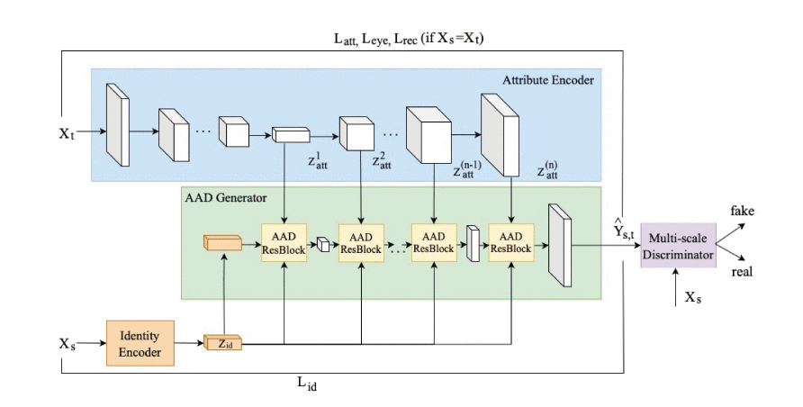
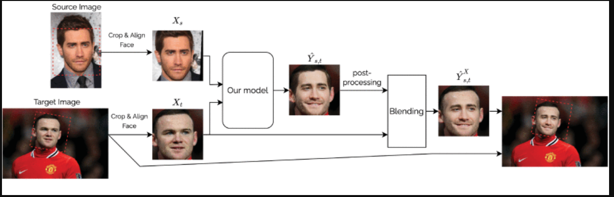
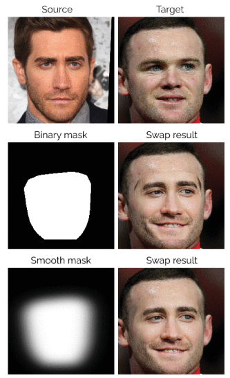

# 3 Лаба

## 1. Ссылка на модель и авторов.
- Разработчиком является лаборатория сбера (у которой сейчас принадлежность к сберу не особо отмечается)
- Соответственно код можно найти в репозитории этой лаборатории: https://github.com/ai-forever/ghost
## 2. Статьи по работе модели.
Есть 2 статьи:
- Научная на ieee: https://ieeexplore.ieee.org/abstract/document/9851423
- Научно-популярная на хабре, которая рассказывает в общем и целом про FaceSwap, и про FaceShifter, на базе идей которого сделан GHOST: https://habr.com/ru/companies/sberbank/articles/575614/
## 3. Суть подхода, архитектура модели
Если составлять выжимку, то GHOST (как и другие faceswap модели) это пайплайн из нескольких нейросетевых моделей и шагов:
- AEI-net
    - ArcFace (Блок Identity encoder) - достаёт и кодирует identity человека, которого надо перенести
    - UNET (Блок Atribute Encoder) - достаём признаки из изображения КУДА переносится лицо.
    - Смешиваем первое со вторым (Блок AAD Generator)
    - Получаем на выходе идентичность лица, которое мы подставляем, и всё остальное от изображения, в которое подставляем.
- Discriminator (в чем и есть отличие GHOST от FaceShifter) - пытается определить, похоже ли сгенерированное изображение на настоящее или нет. Соответветственно будет отвергать варианты, которые не прошли проверку. (Подход называется GAN - генеративно состязательная сеть)
## 4. Процесс обучения и метрики.
Сеть обучалась на VGGFace2 датасете. Обучение происходило в 2 этапа
- "Отключались потери" для глаз и выставлялись веса потерь для некоторых других признаков (возможно это неправильно называть признаками)
- Дообучение в основном для глаз.

Обучение происходило 12 эпох по 16 бачей на Tesla V100. Так же указаны параметры для Adam.

Метрика составлялась на основании результатов других нейросетей. 
- CosFace использовалась для распознования лиц и определения, насколько сохранилась "личность" человека. 
- Ringnet использовалась для восстановления 3D модели лица, для оценки формы и выражения лица. 

## 5. Инференс и преобразования данных.
Пайплайн следующий
- Изображения кропятся и подгоняются по углу.
- Сурс и таргет прогоняются через модель
- Пост-процессинг (например апскейл изображения).
- Составляется маска, по которой подставляется исходное изображение в таргет.
- Происходит бленд - сглаживание углов совмещения сурса и таргета.

## 6. Дообучение 
Авторы предлагают вставлять в Discriminator SoTA модели deep fake detection, что должно дать хороший буст к правдоподобности модели. 
Также, они хотят добавить language-image, чтобы процесс замены можно было контролировать текст промтом.